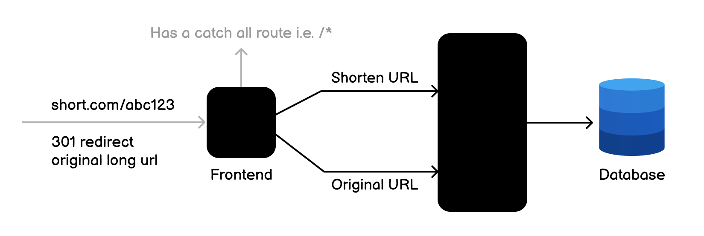

# Gotiny

## Introduction

A fast and efficient link shortener built with Go.
Simplifies and manages long URLs quickly and reliably.

> [!IMPORTANT]
> This project built following the specifications from [roadmap.sh](https://roadmap.sh/projects/url-shortening-service)

## Arquitecture



## Requirements

- Create a new short URL
- Retrieve an original URL from a short URL
- Update an existing short URL
- Delete an existing short URL
- Get statistics on the short URL (e.g., number of times accessed)

## Api Documentation

```bash
POST /api/v1/shorten
{
    "url": "https://www.example.com/some/long/url"
}
```

The endpoint validates the body of the request and return a
201 Created status code with the newly created short URL

```json
{
  "id": "1",
  "url": "https://www.example.com/some/long/url",
  "short_url": "abc123",
  "hits": 39,
  "createdAt": "2021-09-01T12:00:00Z",
  "updatedAt": "2021-09-01T12:00:00Z"
}
```

or a 400 Bad Request status code with error messages in case of validation errors.
Short codes are unique and randomly generated.

### Retrieve Original URL

Retrieve the original URL from a short URL using the GET method

```bash
GET /api/v1/shorten/abc123
```

The endpoint returns a 200 OK status code with the original URL

```json
{
  "id": "1",
  "url": "https://www.example.com/some/long/url",
  "short_url": "abc123",
  "hits": 39,
  "createdAt": "2021-09-01T12:00:00Z",
  "updatedAt": "2021-09-01T12:00:00Z"
}
```

or a 404 Not Found status code if the short URL was not found.
The frontend is responsible for retrieving the original URL
using the short URL and redirecting the user to the original URL.

### Update Short URL

Update an existing short URL using the PUT method

```bash
PUT /api/v1/shorten/abc123
{
    "url": "https://www.example.com/some/new/long/url"
}
```

The endpoint validates the body of the request and return a
200 OK status code with the updated short URL

```json
{
  "id": "1",
  "url": "https://www.example.com/some/new/long/url",
  "short_url": "abc123",
  "hits": 39,
  "createdAt": "2021-09-01T12:00:00Z",
  "updatedAt": "2021-09-01T12:00:00Z"
}
```

or a 400 Bad Request status code with error messages in case of validation errors.
Returns a 404 Not Found status code if the short URL was not found.

### Delete Short URL

Delete an existing short URL using the DELETE method

```bash
DELETE /api/v1/shorten/abc123
```

The endpoint returns a 204 No Content status code if the short URL was deleted.
or a 404 Not Found status code if the short URL was not found.

### Get Statistics

Get statistics on the short URL using the GET method

```bash
GET /api/v1/shorten/stats/abc123
```

The endpoint returns a 200 OK status code with the statistics

```json
{
  "id": "1",
  "url": "https://www.example.com/some/long/url",
  "short_url": "abc123",
  "hits": 10,
  "createdAt": "2021-09-01T12:00:00Z",
  "updatedAt": "2021-09-01T12:00:00Z"
}
```

or a 404 Not Found status code if the short URL was not found.
